# Publicar los Datos
Para la publicación de los datos obtenidos por la central metereológica se ha optado por hacerlo a través de un servidor externo al proyecto. [ThingSpeak](https://thingspeak.com/).

Veamos una breve descripción de los pasos a seguir para lograr la conexión con este servidor.

## Creación de una Cuenta en ThingSpeak
* Accedemos a la página web: https://thingspeak.com/ 
  
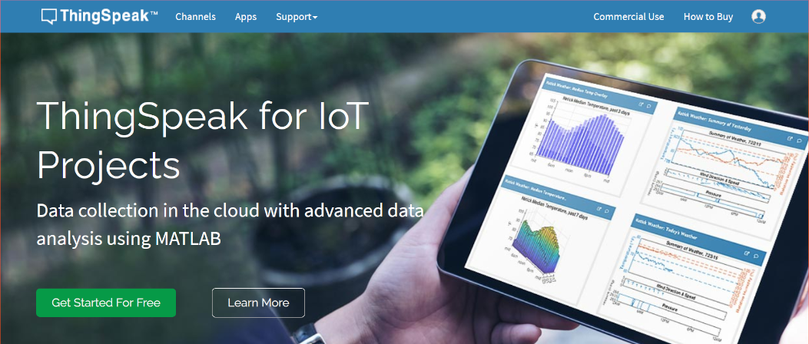
* Pulsamos en el boton que aparece en verde en la parte inferior "Get Started for Free" y llegamos a:
  
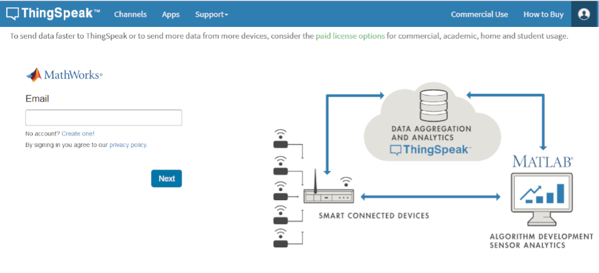
* Pulsamos en "No account? Create one!":
  
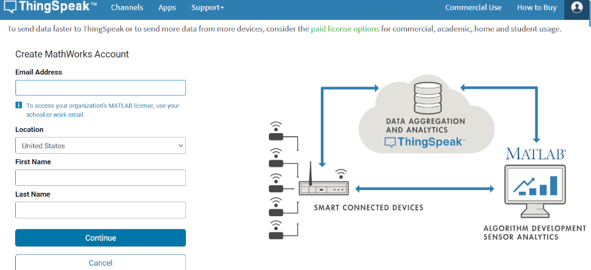 
* Completamos los datos y confirmamos nuestro email. Cuando metemos los datos nos presenta un aviso debido a que detecta que es un email personal, solo tenemos que pusar en:
  
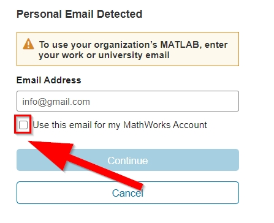 
* Llegamos a una página donde se nos pide la verificación de nuestro email. 
  
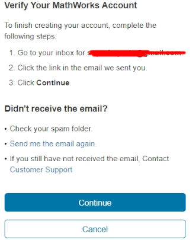  
* Cuando pinchamos en el enlace recibido en el correo, obtendrémos una página dondes se nos confirma la verificación de nuestra cuenta:
  
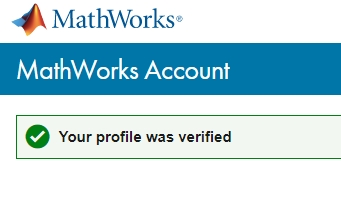  
* Cerramos esta pestaña y volvemos a la anterior, ahora si que pulsamos el botón continue. Se abrirá una última página en la que pondrá "Finish your profile"
    y aquí escribiremos la contraseña que queramos para acceder a nuestra cuenta, aceptando en la casilla de "Online Services Agreement"
    y presionaremos el botón "Continue".
  
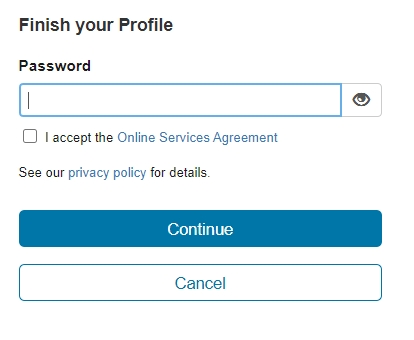  
* Ya tenemos la cuenta creada, no lo confirma la página con:
  
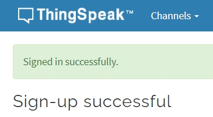  
* Nos piden que completemos una pequeña encuesta, la cual contestaremos así:
 
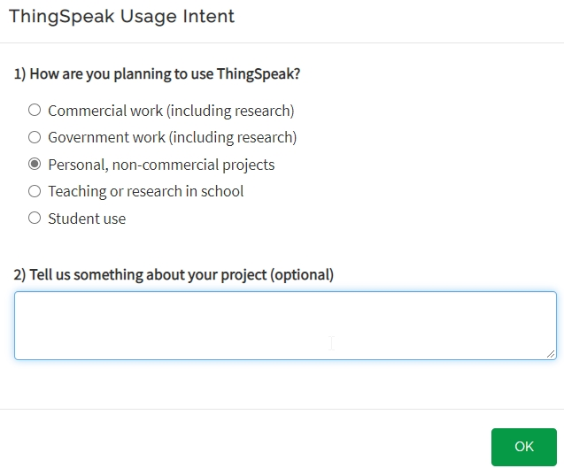 
   
## Creación de un Canal
   
   Una vez creado una cuenta en ThingSpeak. Ahora, tenemos que crear un canal donde se alojarán los datos de nuestra estación metereológica. 
   Para ello seguimos  las siguientes instrucciones:
   * Entramos con nuestro email y contraseña en nuestra cuenta de ThingSpeak.
   * Pulsamos en:
   
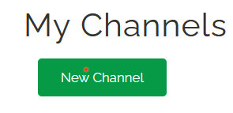 

   * Llegamos a una pagina donde se nos piden los datos de nuestro canal:
     
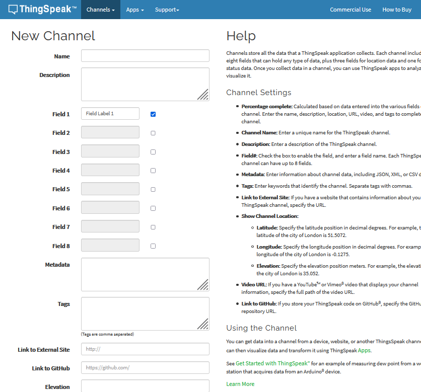 

   * Completamos los datos de nuestra estación: Nombre, pequeña descripción, los campos (Field X) que va a ir recogiendo nuestra estación (pueden ser hasta 8 campos),... Y pulsamos en "Save Channel" .
     
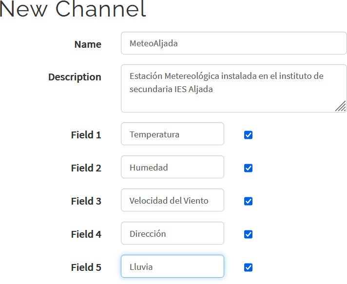 

   * Llegaremos al canal. *MUY IMPORTANTE* pulsamos en * **API Keys** *:
      
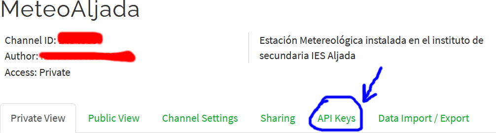 

   * Nos apuntmos nuestra Key que necesitaremos para ponerla en nuetro programa  junto con el * **Channel ID** *:   
      
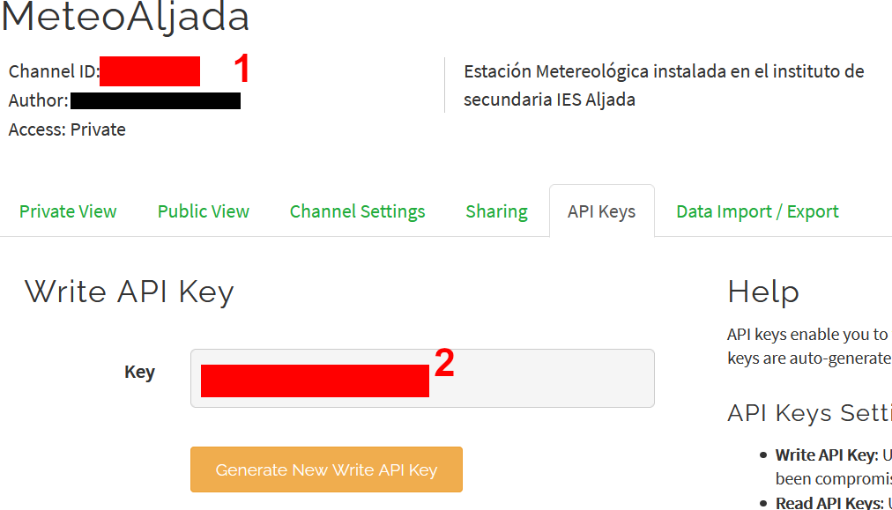 

      
## Actualización del Software

Con los datos btenidos anteriormente: *Channel ID*: XXXXXXX y *API Key*: 1234567890ABCDEF modificamos las constantes con esos valores en el archivo del programa **secrets.h** líneas 9 y 10:

    #define SECRET_CH_ID XXXXXXX		        // replace 0000000 with your channel number
    #define SECRET_WRITE_APIKEY "1234567890ABCDE"   // replace XYZ with your channel write API Key
    
 ## Visualización de los datos
 
 Los datos se pueden visualizar externamente a traves del servidor ThingSpeak. Con la siguiente dirección podremos ver los resultados que se van recogiendo: https://thingspeak.com/channels/TU_CHANNEL_ID
 
    
    
    
    

    
 
