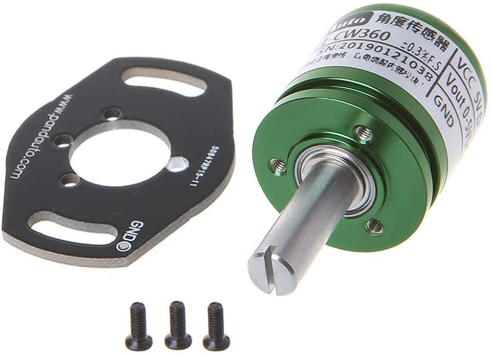

# Hardware

## Electronica

Los dispositivos electrónicos necesarios así como un presupuesto de ellos y la dirección web donde encontrarlos está en la siguiente tabla:
**Observación:** Hay varios precios dependiendo de donde se compre el artículo.
Dispositivo | Descripción | Presupuesto | Link de compra
------------|--------|-------------|---------------
 |Arduino Uno  | 9,90 € (8,90 € con el cable incluido) | [ElectroHobby tienda española](https://www.electrohobby.es/placas-arduino/36-clon-r3.html) /  ([Aliexpress](https://es.aliexpress.com/item/32831857482.html?spm=a2g0o.productlist.0.0.3ce662deg3mzHk&algo_pvid=105d6c86-c513-41ab-a277-119ebfe47045&algo_exp_id=105d6c86-c513-41ab-a277-119ebfe47045-0) )
 | Cable |1 € | [ElectroHobby tienda española](https://www.electrohobby.es/para-arduino/42-usb-arduino-20cm.html)
|Tarjeta de Red W5100 |7,40 € | [ElectroHobby tienda española](https://www.electrohobby.es/shield-arduino/38-ethernet-shield-w5100.html)
|Imán para contador del pluviómetro | 12,99 € (4,20 €) |[Amazon](https://www.amazon.es/Brudazon-Conjunto-Imanes-Discos-Fuerte/dp/B07M7PWWX5/ref=sr_1_8?__mk_es_ES=%C3%85M%C3%85%C5%BD%C3%95%C3%91&dchild=1&keywords=neodimio+im%C3%A1n+2x1mm&qid=1625338244&sr=8-8) ([Aliexpress](https://es.aliexpress.com/item/1005001614055650.html?spm=a2g0o.productlist.0.0.2e237948YRcd6q&algo_pvid=6d57c161-4691-41d8-a869-4610a2a55d7c&algo_exp_id=6d57c161-4691-41d8-a869-4610a2a55d7c-1))
|Sensor magnético para contador pluviómetro | 3,67 € (1,40 €)| [Amazon](https://www.amazon.es/gp/product/B01GWJ86O4/ref=ppx_yo_dt_b_asin_title_o04_s00?ie=UTF8&psc=1) ([Aliexpress](https://es.aliexpress.com/item/4000217757828.html?spm=a2g0o.productlist.0.0.4d5831eccouJY9&algo_pvid=ef1f6b36-751e-4e46-b368-3af556e2164a&algo_exp_id=ef1f6b36-751e-4e46-b368-3af556e2164a-0))
|Rodamiento para el eje de la veleta |9,99 € | [Amazon](https://www.amazon.es/gp/product/B079DL4NKW/ref=ppx_yo_dt_b_asin_title_o05_s00?ie=UTF8&psc=1)
|Tubo hueco cuadrado (aluminio)| 15,47 €| [Amazon}(https://www.amazon.es/gp/product/B0029ZV8YQ/ref=ppx_yo_dt_b_asin_title_o05_s01?ie=UTF8&psc=1)
|Sensor de ánguloefecto Hall | 19,44 € | [Amazon](https://www.amazon.es/Kcnsieou-Potenci%C3%B3metro-anal%C3%B3gico-desplazamiento-rotaci%C3%B3n/dp/B08FRJCTZZ/ref=sr_1_1?dchild=1&keywords=%E2%80%8E1AA701155&qid=1625388731&sr=8-1)
|Sensor de humedad y temperatura | 3,59 € (1,70 €) | [Amazon](https://www.amazon.es/Guangcailun-Digital-Temperatura-Relativa-Humedad/dp/B08H7HJQ79/ref=sr_1_37?__mk_es_ES=%C3%85M%C3%85%C5%BD%C3%95%C3%91&crid=3UJNPBVR28JZK&dchild=1&keywords=dht11+sensor&qid=1625388876&sprefix=dht11%2Cdiy%2C201&sr=8-37) ([Aliexpress](https://es.aliexpress.com/item/32945476028.html?spm=a2g0o.productlist.0.0.6d2043b3siM8VM&algo_pvid=b11fe4fe-8f77-490a-89b8-ffa19a181cb6&algo_exp_id=b11fe4fe-8f77-490a-89b8-ffa19a181cb6-1))
|Bobina PLA para la impresora 3D| 19,99€  | [PC Componentes](https://www.pccomponentes.com/sakata-3d-bobina-de-filamento-pla-3d850-175mm-blanco-1kg)
|Motor para el anemómetro| 5,90€  | [Amazon](https://www.amazon.es/Rajotero-Mini-Motor-15000-Motores/dp/B07GPQV6V1/ref=sr_1_5?__mk_es_ES=%C3%85M%C3%85%C5%BD%C3%95%C3%91&keywords=motor+5v&qid=1583399111&sr=8-5)
|Anemámetro digital (para calibrar)| 21,99€  | [Amazon](https://www.amazon.es/Anem%C3%B3metro-Term%C3%B3metro-Digital-Pantalla-Velocidad/dp/B0761NK4GH/ref=mp_s_a_1_3?keywords=anemometro&qid=1581617937&sr=8-3)
|Soporte estación metereológica| 17,24€  | [IpCenter](https://www.ipcenter.es/ib-06.html)

