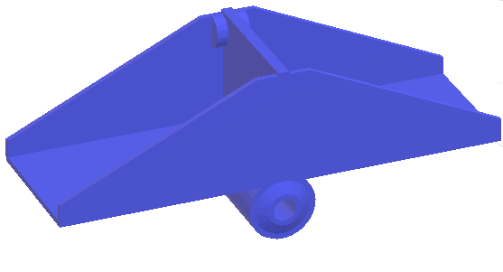
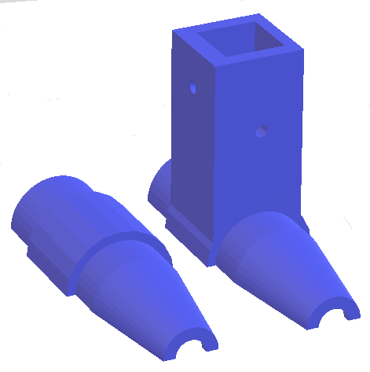
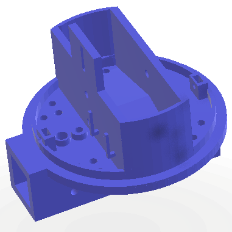
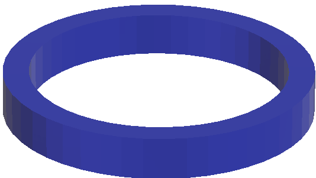
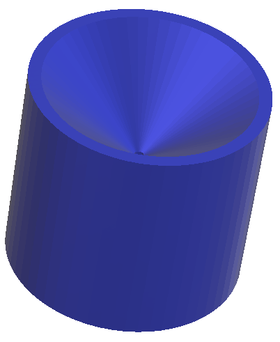
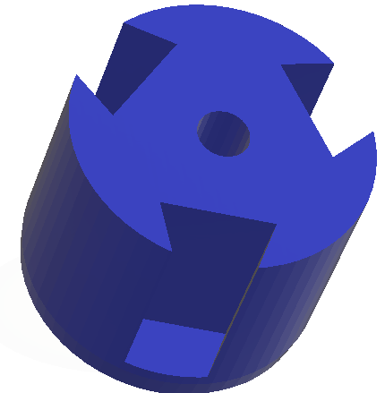
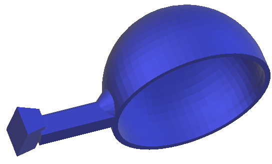
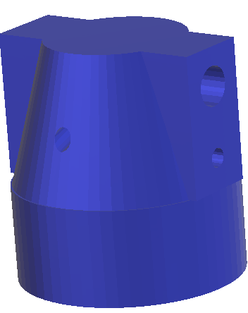
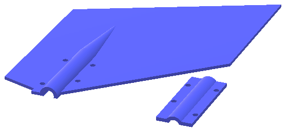

# Piezas 3D

En este directorio, puedes encontrar las piezas 3D en ficheros stl. Este formato es reconocido por la mayoría de 
los programas de diseño **CAD** tipo Autocad.
Las piezas son:

## **Archivo:** [*balancin.stl*](https://github.com/IESAljada/RedMeteo/blob/main/Piezas_3D/balancin.stl)

## **Archivo:** [*base_anem_veleta.stl*](https://github.com/IESAljada/RedMeteo/blob/main/Piezas_3D/base_anem_veleta.stl)

  

    

## **Archivo:** [*base_pluviometro.stl*](https://github.com/IESAljada/RedMeteo/blob/main/Piezas_3D/base_pluviometro.stl)

## **Archivo:** [*brida.stl*](https://github.com/IESAljada/RedMeteo/blob/main/Piezas_3D/brida.stl)

## **Archivo:** [*capsula_pluviometro.stl*](https://github.com/IESAljada/RedMeteo/blob/main/Piezas_3D/capsula_pluviometro.stl)

## **Archivo:** [*conector_anem.stl*](https://github.com/IESAljada/RedMeteo/blob/main/Piezas_3D/conector_anem.stl)

## **Archivo:** [*paletas_anem.stl*](https://github.com/IESAljada/RedMeteo/blob/main/Piezas_3D/paletas_anem.stl)

## **Archivo:** [*soporte_veleta.stl*](https://github.com/IESAljada/RedMeteo/blob/main/Piezas_3D/soporte_veleta.stl)

## **Archivo:** [*veleta.stl*](https://github.com/IESAljada/RedMeteo/blob/main/Piezas_3D/veleta.stl)

