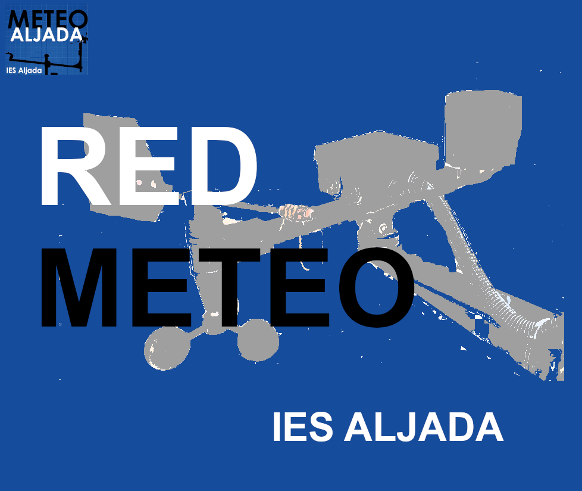
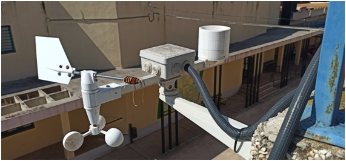
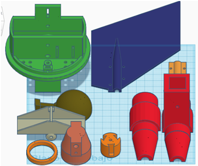
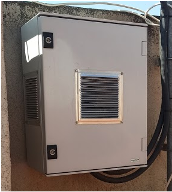
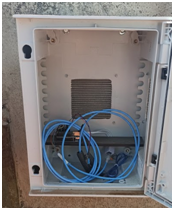
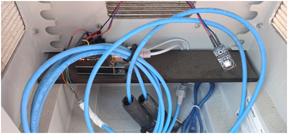
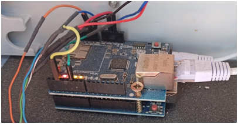

# RedMeteo

 
 
# Objetivo
Con esta experiencia, intentamos trabajar los Objetivos de Desarrollo Sostenible. Deben ser el hilo conductor para lograr avanzar en la sociedad. El trabajo en estos ODS son la base para obtener una sociedad crítica y reivindicativa y así para seguir avanzando.
Con esta experiencia pretendemos establecer una red de centros interconectados con un nexo en común: la concienciación de las nuevas generaciones en la defensa de nuestro mundo. Esta experiencia pretende la educación integral de las nuevas generaciones, diseñando, estudiando, creando y evaluando nuestro entorno.
La tecnología es el punto de partida, pero no es el fin.
La estación meteorológica de la que partimos esta instalada en el IES Aljada de Puente Tocinos.

 

# Hardware
## Piezas 3 D 
[Link a Piezas 3D](https://github.com/IESAljada/RedMeteo/tree/main/Piezas_3D)

Todas las piezas han sido diseñadas e impresas con una impresora 3d.  Existen archivos para ser distribuidos con todas las piezas:

 
# Electrónica
[Link a Hardware](https://github.com/IESAljada/RedMeteo/tree/main/Hardware)

Estas piezas se montan sobre una barra de aluminio y se introducen sensores para la toma de datos que van a ser gestionados con un Arduino uno instalado en una caja:

Esta caja está instalada en una pared, preferiblemente dando al norte ya que dentro hay un sensor de temperatura y humedad.

 
 
 
 

 

La relación de dispositivos electrónicos necesarios se describe en un archivo adjunto con su presupuesto.
El circuito eléctrico con todas las conexiones es:
 
# Software
[Link a Software](https://github.com/IESAljada/RedMeteo/tree/main/Software)

Otro campo interesante en la formación de los alumnos es el software. Empezar entendiendo el funcionamiento del programa es el inicio para despertar inquietudes y empezar a realizar pequeñas modificaciones sobre el programa base que permitirán a los alumnos adentrarse en esta disciplina. El programa aparece comentado en un archivo adjunto.

La central se conecta a internet, para ello se necesita tener un cable de red conectado a la placa.
Los datos se envían periódicamente a Thingspeak. Donde previamente se ha creado una cuenta y se han definido los campos que se van a mostrar. La creación de la cuenta aparece descrita en un archivo adjunto.

Ahora ya solo la imaginación es el límite, podemos empezar a compartir datos, experiencias, etc

# Funcionamiento

En el siguiente [link](https://github.com/IESAljada/RedMeteo/tree/Funcionamiento) se encuentra una explicación más detallada del funcionamiento así como varios videos donde los profesores y alumn@s describen los problemas encontrados y las soluciones aportadas.

Ánimo, esto empieza ahora…..

[Versión pdf](README/RedMeteo.pdf)

